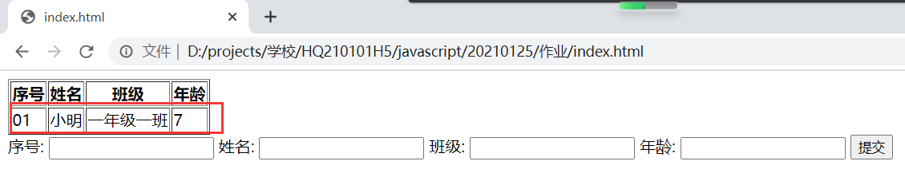

# 要求
1. 变量练习
    - 声明变量 x 值为数字类型
    - 声明变量 y 值为数字类型
    - 尝试执行 x 和 y 之间的四则运算，并打印出运算结构
2. 声明两个学生对象，分别叫 `Amy` 和 `Bob`，然后完成以下操作：
    - 分别给两个学生添加 `年龄` 和 `班级` 属性
    - 使用 console 打印学生们的所有信息
3. 创建一个表格，如图：；当填写好表单以后，点击提交按钮，让表格中插入一行新数据，如图：

