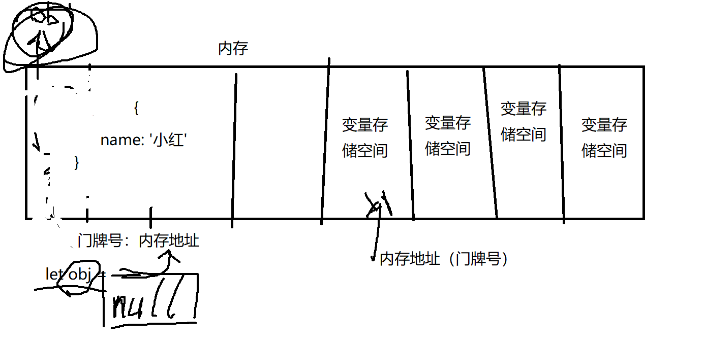

# 数据类型
// mdn 数据类型：https://developer.mozilla.org/zh-CN/docs/Web/JavaScript/Data_structures#%E6%95%B0%E6%8D%AE%E7%B1%BB%E5%9E%8B

数据类型是什么？js中对不同种类数据的一个类型分类

mdn 为数据类型一共定义了 8 种：

7 种原始类型
- undefined
- Boolean
- Number
- String
- BigInt
- Symbol
- null
最后一种类型是：
- Object

数据按照参数的传递方式，可以分为 `值传递类型` 和 `引用传递类型`

## 值类型

- Boolean 布尔型
- Number 数字型
- String 字符串
- BigInt 长整数

## 引用类型

- Object 对象类型
- symbol 符号类型

## undefined 未定义
undefined 是一个单独的类型，用于给未定义的变量赋值

## null 空引用
null 值的是空引用，是 js 的一个原始数据类型，用来指代引用类型数据的空值

## 值类型和引用类型数据的区别
值类型：变量中直接存贮值本身
引用类型：变量中存储的是引用地址，而值是存在引用地址所指向的内存中的某个对应位置

结合下图理解：

