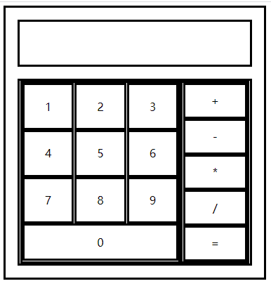

# 要求
在以给出的计算器页面上，完成以下功能

- 用户需要输入两个数字用于运算
- 输入第一个参数后点击除 “=” 等号以外的运算符，记录要执行的运算规则，然后开始接收用户的第二个数字输入
- 点击等号，将第一个数字和第二个数字进行第二步中记录的操作
- 将结果显示到显示屏上

## 帮助
```js
let btn = document.querySelector('.num-s:first-child')
btn.addEventListener('click', function () {
    console.log(this) // this 可以获取到 btn 元素自身
})
```

## 效果图

