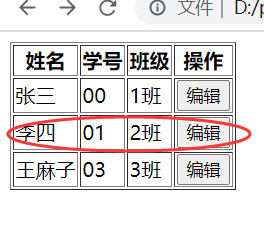
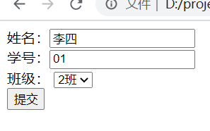

# 要求
- 创建一个页面 `index.html`
- 在 `index.html` 中创建一个表格，表格中的数据通过数组进行渲染
- 每行末尾有个 `编辑` 按钮，点击按钮，将该行数据作为浏览器地址栏参数，传递到第二个页面 `edit.html` 中
- `edit.html` 获取 `index.html` 传递的参数
- `edit.html` 页面中创建一个表单，表单项对应传递的参数，然后将参数显示在表单中

# 效果
`index.html` 如下：

若点击第二行数据的 `编辑` 按钮，则跳转到 `edit.html` 页面，如图

